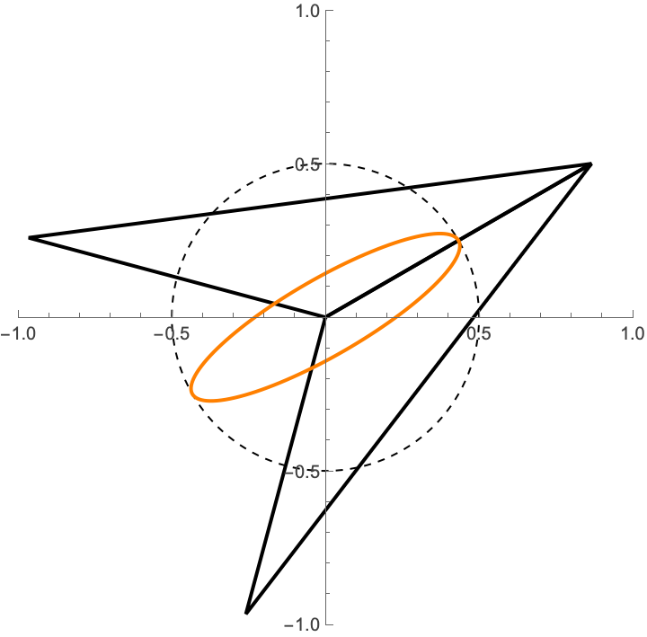

# Asteroids Game
## Tutorial Exercise 4: Weapon and Firing Logic

## 1. Introduction

In this tutorial exercise, we will add a weapon system to the ship. No new drawing commands are introduced in this exercise. 

**Learning Objective:** Consolidate core game design concepts and apply encapsulation practices to the main game engine. This will allow us to easily manage timing logic and rendering operations for fired projectiles.

## 2. Weapon Handling

We will take advantage of our object-oriented design to add a weapon. Because there is a *has-a* relationship between the ship and the weapon, we will extend the `Ship` class to include weapon functionality. 

The weapon can be controlled using the **Space Bar**. When held down, the weapon fires projectiles at a constant rate, traveling at a fixed speed in the fired direction.

*Note: For now, projectiles will not interact with asteroids; collision detection will be handled in a later exercise.*

### Firing Logic and Projectile Storage

To manage projectiles, we need:
1. **Timing Mechanism:** Ensures projectiles are fired at a consistent rate.
2. **Sequential Container:** Stores active projectiles so we can easily iterate over them to advance their positions frame-to-frame, render them, and remove any that leave the screen.

## 3. Drawing Projectiles

We rely on SFML Graphics to render projectiles on screen, similar to how we draw the ship.

Projectiles are modeled as an ellipse formed by scaling down a circle along its local y-axis relative to the ship's coordinate system. When fired, the center of the projectile coincides with the center of the ship, and its major axis aligns with the ship's local x-axis.

All the drawing is handled by the `Ship::draw()` function, so that no changes are necessary to the main rendering loop. 

## 4. Student Tasks

Starter code for this exercise is provided in the repository. Most functionality is already implemented, except for the following tasks:

1. Advancing projectiles from frame to frame.
2. Drawing projectiles from frame to frame.

All code to be completed resides in `ship.cpp`. Please complete the missing sections, then compile and run your program to ensure projectiles fire correctly when holding down the space bar.

## Submission

Submit your completed exercise via **Gradescope** under the assignment titled **Tutorial Exercise 4** before the end of your scheduled tutorial session.

Upload **only** the file you have modified (`ship.cpp`); do not upload the entire repository.

